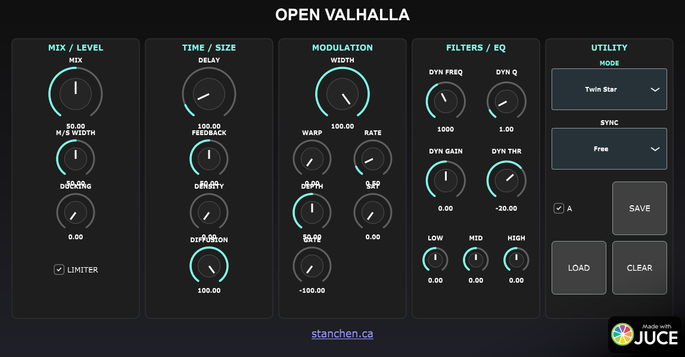

# Open Valhalla

**Open Valhalla** is an open-source, modular reverb engine offering high-fidelity algorithms inspired by classic space reverberators. It features deep modulation, multiple reverb modes, and VST3 compatibility.



> **Note:** This project is an **educational recreation and tribute**. It captures the spirit and workflow of classic hardware but uses standard DSP blocks rather than exact circuit modeling or proprietary FDN algorithms. See [COMPARISON.md](COMPARISON.md) for a detailed architectural comparison.

## Features

*   **21 Unique Reverb Modes**: Ranging from fast echoes to massive lush spaces and looping delays.
*   **Modular DSP Chain**:
    *   **Pre-Delay**: Up to 2000ms with modulation.
    *   **Warp**: Controls the modulation feedback and character.
    *   **Reverb Core**: Feedback Delay Network (FDN) based reverb with feedback and density controls.
    *   **EQ**: Low and High cut filters to shape the tone.
*   **Deep Modulation**: Adjustable Rate and Depth for chorus-like textures or pitch-shifting tails.
*   **Custom UI**: Dark, flat design inspired by classic hardware and software units.

## Controls

*   **MIX**: Controls the balance between the dry and wet signal.
*   **DELAY**: Sets the pre-delay time (0-1000ms).
*   **FEEDBACK**: Controls the decay time of the reverb tail.
*   **WIDTH**: Adjusts the stereo width of the output.
*   **WARP**: Adds modulation feedback and coloration.
*   **DENSITY**: Controls the density/diffusion of the reverb reflections.
*   **MOD RATE**: Sets the speed of the modulation LFO.
*   **MOD DEPTH**: Sets the intensity of the modulation.
*   **EQ HIGH/LOW**: Cuts high or low frequencies from the reverb tail.

## Algorithms (Modes)

*   **Twin Star**: Fast attack, shorter decay, high echo density.
*   **Sea Serpent**: Fast-ish attack, shorter decay, varying density.
*   **Horse Man**: Medium attack, longer decay, medium-high density.
*   **Archer**: Slow attack, longer decay, high density.
*   **Void Maker**: Medium attack, very long decay, massive spaces.
*   **Galaxy Spiral**: Slowest attack, very long decay, very high density.
*   **Harp String, Goat Horn, Nebula Cloud, Triangle**: Various combinations of attack, decay, and echo patterns.
*   **Cloud Major/Minor**: Strange repeating patterns with low density.
*   **Queen Chair/Hunter Belt**: Low initial density building to massive reverbs.
*   **Water Bearer/Two Fish**: EchoVerb algorithms with audible delays morphing into reverb.
*   **Scorpion Tail, Balance Scale, Lion Heart, Maiden, Seven Sisters**: Complex feedback and filtering networks.

## Installation

### For Users
Download the latest Release for your operating system (Windows, Mac, or Linux) from the [Releases](../../releases) page. The release will be a `.zip` file (e.g., `Open_Valhalla_VST3_Linux.zip`).

1.  **Unzip** the downloaded file.
2.  **VST3 Plugin**:
    *   Find the `Open Valhalla.vst3` file (or folder).
    *   Copy it to your system's VST3 directory:
        *   **Windows**: `C:\Program Files\Common Files\VST3\`
        *   **Mac**: `/Library/Audio/Plug-Ins/VST3/`
        *   **Linux**: `~/.vst3/` or `/usr/lib/vst3/`
3.  **Standalone Application** (Optional):
    *   Find the `Open Valhalla` executable (or app bundle).
    *   You can run this directly or copy it to your Applications folder.

### For Developers
See the [Build Instructions](#build-instructions) below.

## Build Instructions

### Prerequisites
*   **CMake** (3.15 or higher)
*   **C++ Compiler** with C++17 support (MSVC, Clang, GCC)
*   **Linux Dependencies**:
    ```bash
    sudo apt-get install libwebkit2gtk-4.1-dev libasound2-dev libx11-dev libfreetype6-dev libcurl4-openssl-dev libxrandr-dev libxinerama-dev libxcursor-dev libgl1-mesa-dev
    ```
    *(Note: On some systems `libwebkit2gtk-4.0-dev` may be required instead.)*

### Building

#### Linux / macOS
```bash
cmake -B build -S . -DCMAKE_BUILD_TYPE=Release
cmake --build build --config Release
```

#### Windows
```cmd
cmake -B build -S .
cmake --build build --config Release
```

The compiled VST3 plugin will be located in:
*   `build/VST3OpenValhalla_artefacts/Release/VST3/` (Windows/Linux)
*   *Or* `build/VST3OpenValhalla_artefacts/VST3/` (depending on CMake generator)

The Standalone application will be in:
*   `build/VST3OpenValhalla_artefacts/Release/Standalone/`
*   *Or* `build/VST3OpenValhalla_artefacts/Standalone/`

## Project Structure

*   **Source/**: Contains the C++ source code.
    *   `PluginProcessor.cpp/h`: Handles audio processing and state management.
    *   `PluginEditor.cpp/h`: Handles the GUI implementation.
    *   `ReverbProcessor.cpp/h`: Encapsulates the core DSP logic.
*   **release/**: Contains the zipped release artifacts.
*   **COMPARISON.md**: detailed architectural comparison with reference hardware/software.

## License

This project is open-source. JUCE is used under the GPLv3/Commercial license.

## Credits

This is an educational recreation and tribute to the incredible work of Valhalla DSP.
